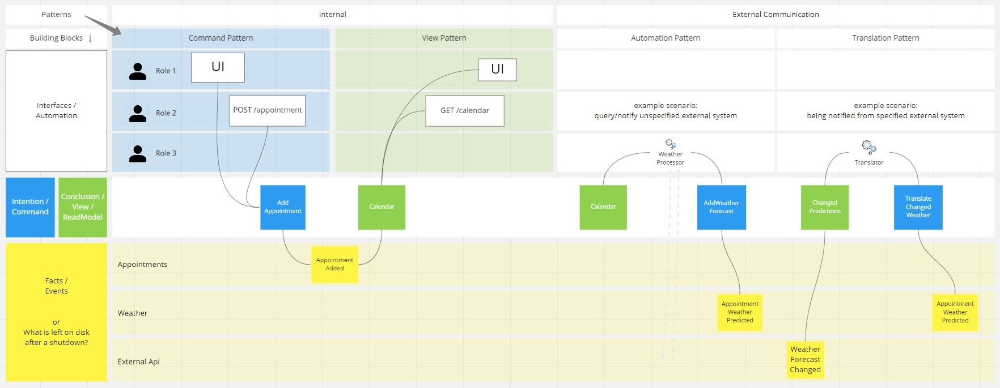

[high res version](cheatsheet.jpg)

If you start an EventModeling workshop it is important to get everyone quickly. 

on board quickly and not everybody is familiar with EventModeling. Use this cheat sheet in order to quickly get everyone on board and let everyone see the simplicity behind EventModeling.

# Building Blocks
On the left side there are the possible building blocks you can use in your Event Model:

* Trigger: An Interface which can be a UI or a public Rest-API. Or an automated process# Patterns
* Command: Stands for an intention
* View: Stands for Conclusion, Report or ReadModel.
* Event: Stands for a business fact that has been saved to disk

On the right side the possible patterns are shown and how the building blocks are being connected:

# Patterns
Internal Patterns:

Patterns that automate and/or do external communication
