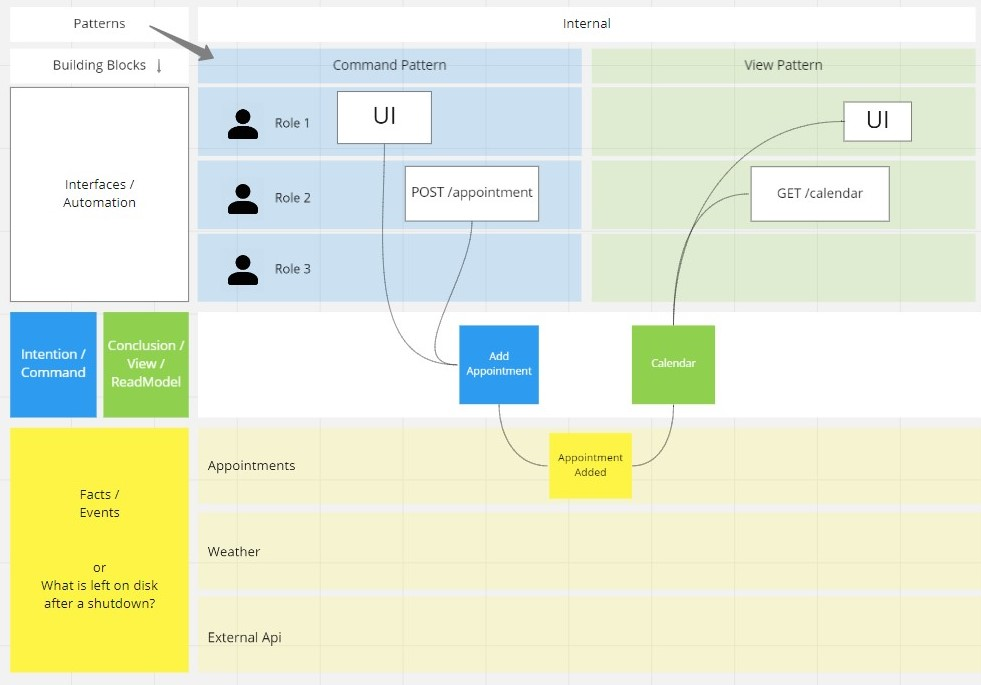

Did you ever struggle explaining EventModeling to others? Here is a cheat sheet that you can take to a Workshop in order to quickly introduce EventModeling.

Even though the basic principles are quite simple, questions quickly come up when it comes to more complex scenarios. Use the sheet to answer them:
* What is the usual flow within an EventModel? 
	* -> Command/View Pattern
* How do i model notifications / queries of some external system that i do not want to model explicitly as events?
	* -> Automation Pattern
* How do i model event based communication between known systems? 
	* -> Translation Pattern

Let´s remember the building blocks that are being used in EventModeling:

# Building Blocks
* Trigger: An Interface which can be a UI or a public Rest-API. Or an automated process# Patterns
* Command: Stands for an intention
* View: Stands for Conclusion or ReadModel
* Event: Stands for a business fact that has been saved to disk

And here is how they can be combined in the 4 different recurring patterns of EventModeling:

# Internal Patterns

# Patterns that automate external communication

[high res version](cheatsheet.jpg)